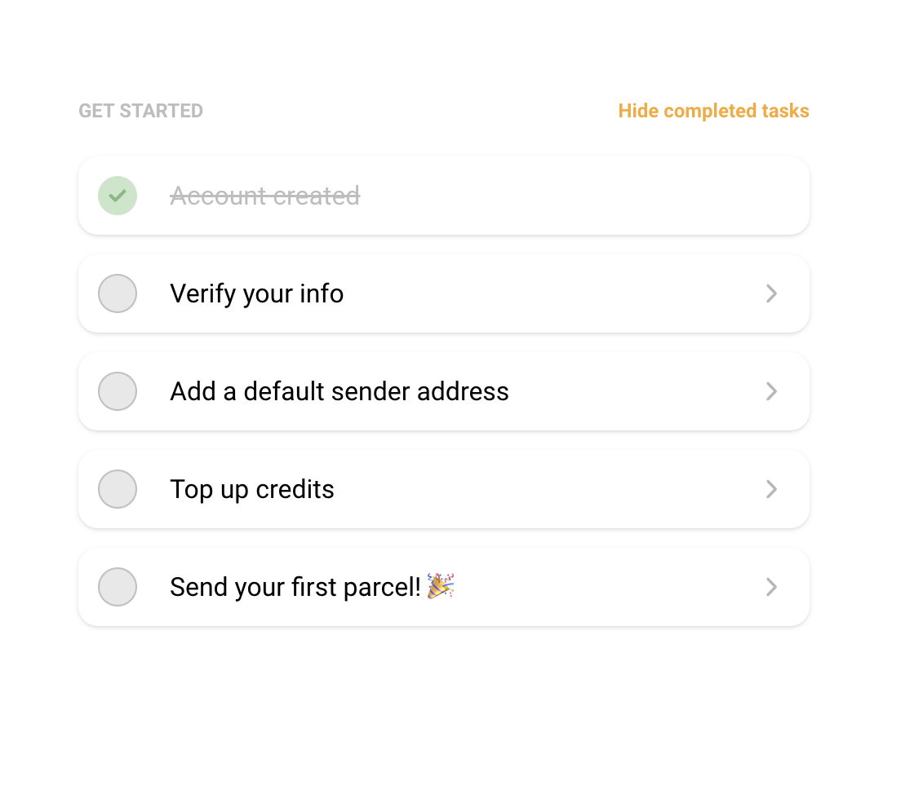

# react-to-do-list

React To Do List with Tailwind CSS



## Run Locally

Clone the project

```bash
  git clone https://github.com/raditya-bfi/react-todo-list.git
```

Go to the project directory

```bash
  cd react-todo-list
```

Install dependencies

```bash
  yarn install
```

Start the DEV server

```bash
  yarn dev
```

Start the SIT server

```bash
  yarn sit
```

Start the UAT server

```bash
  yarn uat
```

## **Options ✍️**

Check lint

```
yarn lint
```

Fix lint

```
yarn lint:fix
```

Check prettier

```
yarn prettier
```

Fix prettier

```
yarn prettier:fix
```

Fix lint and prettier

```
yarn format
```

## Running Tests

To run tests, run the following command

```bash
  yarn test
```
